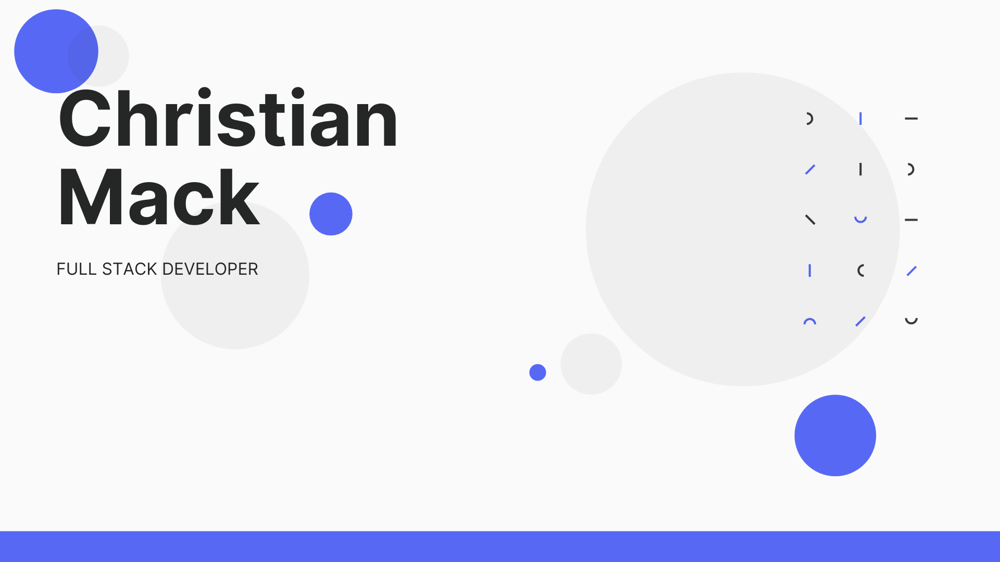

 
 

# About Me

- 🔭 I’m currently working on a ReDesigning my portfolio
- 🌱 I’m currently learning UI UX design
- 💬 Ask me about current passion project
- 📫 How to reach me: christian.ak.mack@gmail.com
- ⚡ Fun fact: I have seven years professional experience working in fine dining restaurants as a Chef

# Connect With Me

<a href="https://www.iamchristianmack.com">iamchristianmack.com</a>
 
<a href="https://www.linkedin.com/in/chrismackca">​linkedin.com/in/chrismackca</a>

# Skills

### LANGUAGES
    ​JavaScript ES5/ES6, Python, HTML5, CSS

### FRAMEWORKS & LIBRARIES
    ​ReactJS, NodeJS, Express, Less/Sass, Jest, React Testing Library, Material UI, Bootstrap, Mongoose

### TOOLS
    ​Git, GitHub, Heroku, Netlify, VS Code, Atom, Terminal, Postman

### DATABASES
    SQLite, PostgresQL, MongoDB

### SOFTWARE DEVELOPMENT
    RESTful APIs, Object Oriented Programming, AGILE Development
